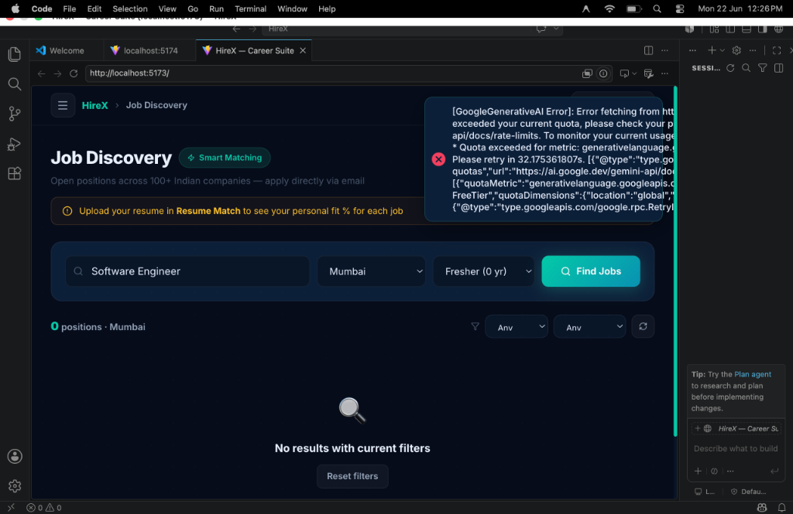
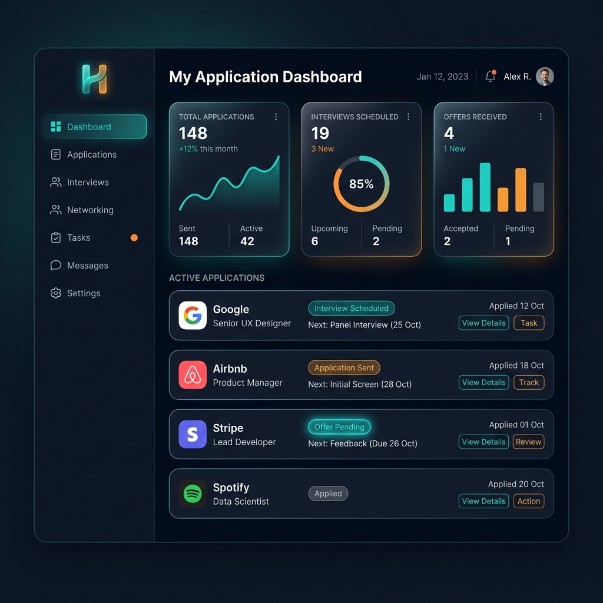
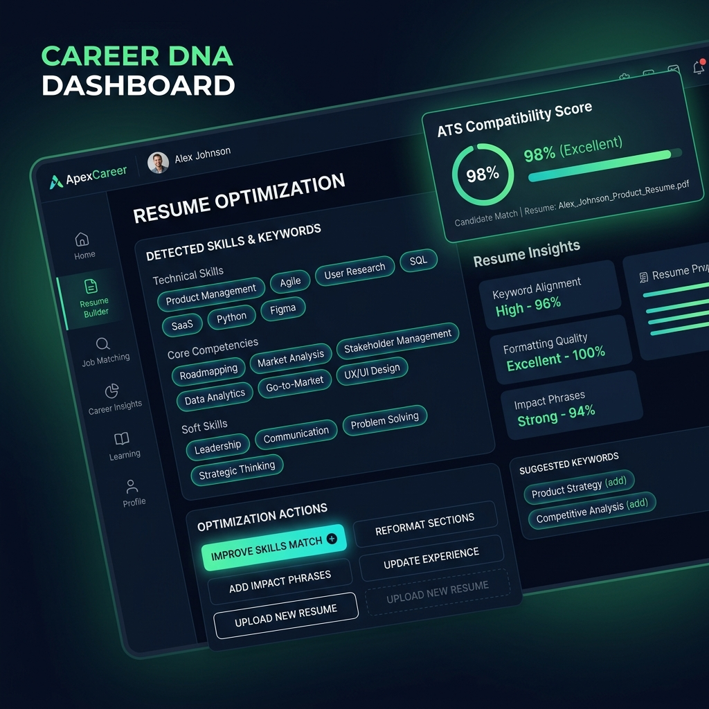
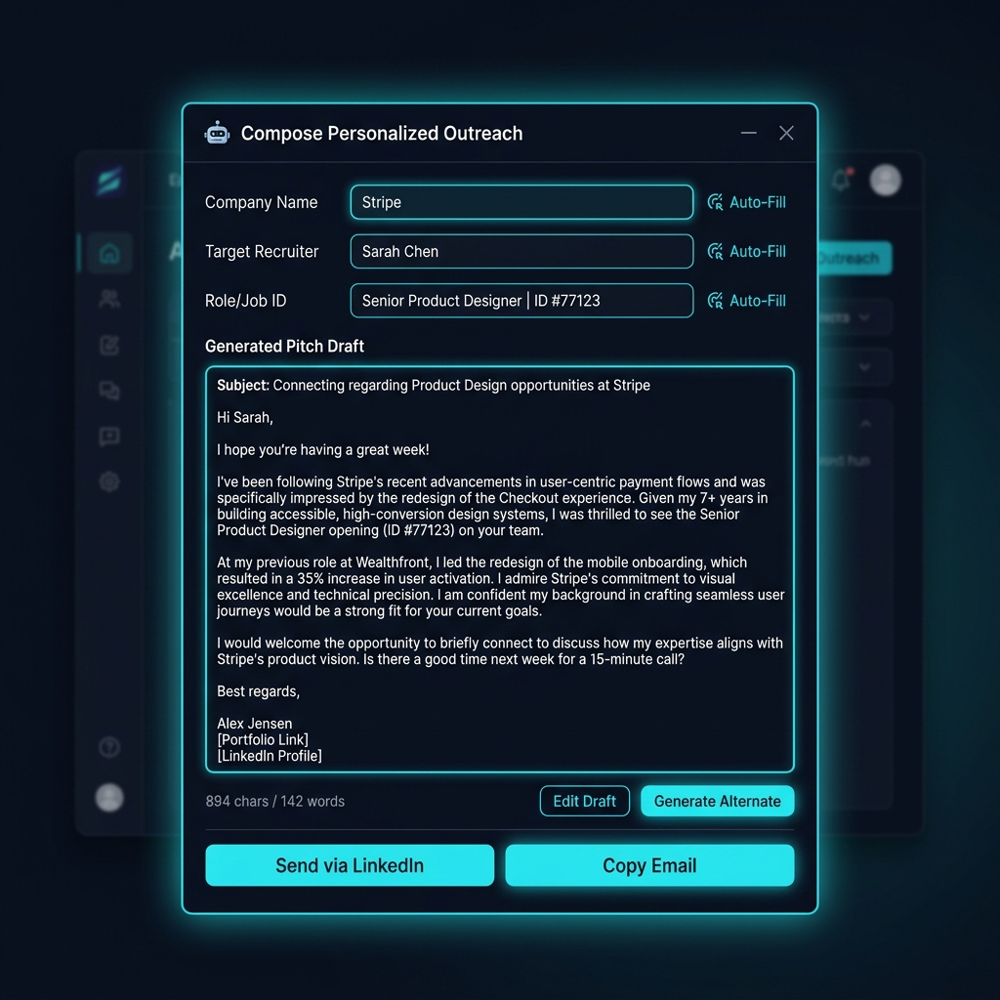
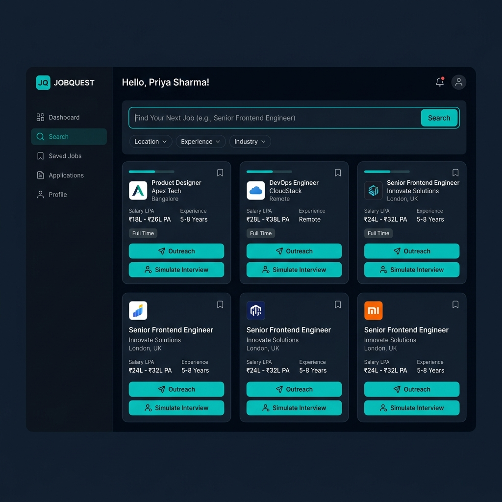

     

# HireX — AI-Powered Career Intelligence Suite

*An end-to-end AI career platform that replaces 6 separate tools with one intelligent system.*

[](https://hirex-9g9p.onrender.com)

## What is HireX?

HireX is a full-stack career intelligence platform that consolidates the entire job-search workflow into a single AI-driven application. From mock interviews powered by voice AI to ATS-optimized resume tailoring, it eliminates the need to juggle multiple disconnected tools. Built on the MERN stack with Google Gemini integration, HireX delivers real-time, personalized career assistance at every stage of the hiring pipeline.

## 🎥 See it in Action
*How it works in 60 seconds*

[](https://www.youtube.com/watch?v=YOUR_VIDEO_ID)

> **Note:** Click the image above to watch the 60-second product walkthrough.

## Core Features

### 🎙️ AI Voice Mock Interview
Practice interviews with a real-time AI interviewer that listens, responds, and evaluates your answers. Receive instant feedback on content quality, communication clarity, and confidence — all powered by Google Gemini and the Web Speech API.

### 📄 ATS Resume Scanner & 1-Click Tailor
Upload your resume and a target job description to get an instant ATS compatibility score. One click generates a tailored version of your resume with optimized keywords, reformatted bullet points, and improved alignment to the role.

### ✉️ Cold Outreach Engine
Generate personalized cold emails and LinkedIn messages for recruiters and hiring managers. Provide the company, role, and your background — Gemini crafts a compelling, professional outreach message ready to send.

### 📊 Application Pipeline Tracker
A Kanban-style board to manage every application from "Wishlist" through "Applied," "Interview," to "Offer." Track statuses, add notes, and never lose sight of where you stand across dozens of opportunities.

### 🪪 Shareable Career Card
Auto-generate a polished, shareable digital profile card from your resume data. Share a single link with recruiters that showcases your skills, experience, and contact info in a clean, branded format.

### 🔍 Smart Job Discovery
Search and filter curated job listings aggregated from multiple sources. AI-powered relevance ranking surfaces roles that best match your profile, skills, and career preferences.

## Tech Stack

| Layer       | Technology                          |
|-------------|-------------------------------------|
| Frontend    | React 19, Vite, React Router v7    |
| Backend     | Node.js, Express.js                |
| Database    | MongoDB Atlas, Mongoose             |
| AI Engine   | Google Gemini API                   |
| Auth        | JWT, bcrypt                         |
| Voice       | Web Speech API (STT/TTS)            |
| Deployment  | Render (Full-Stack)                 |

<details>
<summary>📸 View Screenshots</summary>
<br>







</details>

## Quick Start

```bash
git clone https://github.com/your-username/HireX.git
cd HireX

# Install dependencies
npm install
cd client && npm install && cd ..

# Configure environment
cp .env.example .env
# Add your MONGO_URI, JWT_SECRET, and GEMINI_API_KEY

# Run development servers
npm run dev
```

## Architecture

- **Monorepo structure** — Express API server and React SPA co-located with a proxy-based dev setup for seamless local development.
- **Stateless REST API** — JWT-authenticated endpoints with role-based middleware; every AI feature is an isolated service module behind a dedicated route.
- **AI Service Layer** — All Gemini interactions are abstracted into a service layer with prompt templates, retry logic, and structured JSON response parsing.
- **Single-command deploy** — Render builds the React client as static assets served by Express, enabling full-stack deployment from one service with zero additional configuration.

## License

This project is licensed under the [MIT License](LICENSE).
